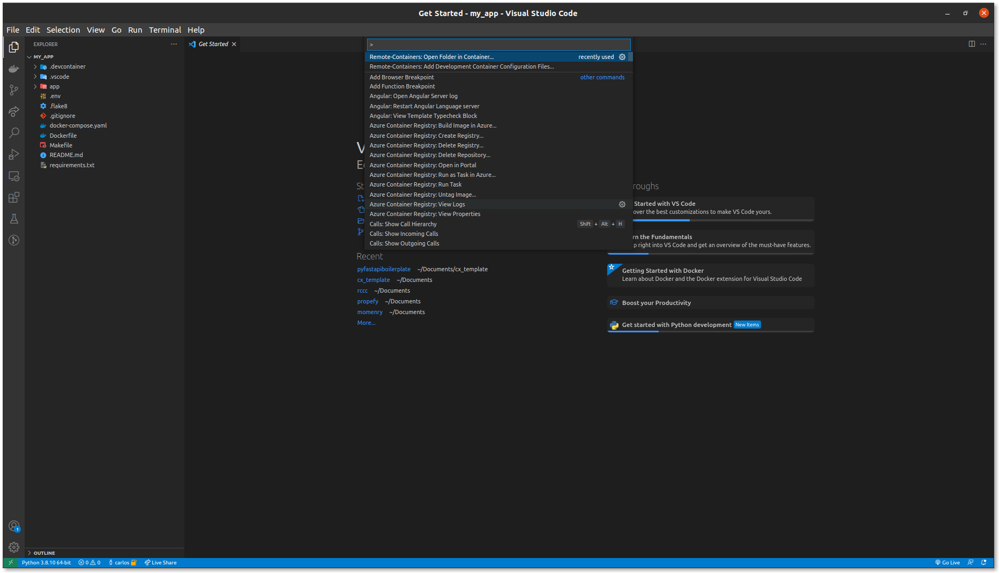
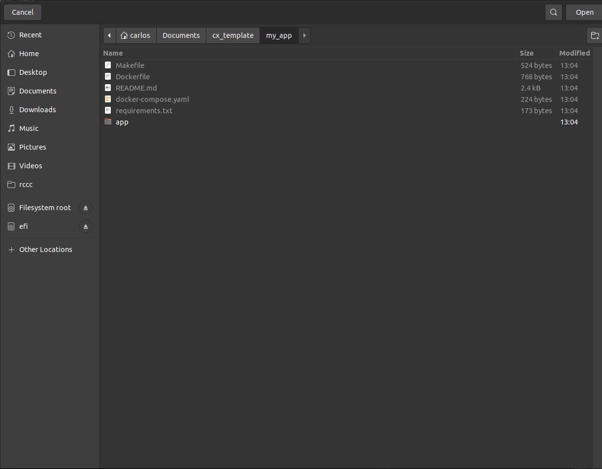
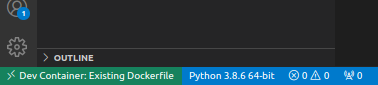
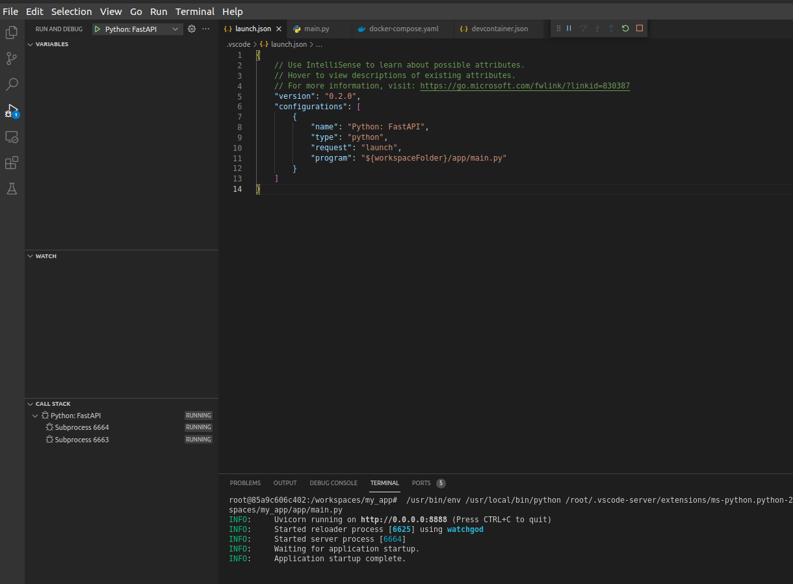
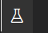
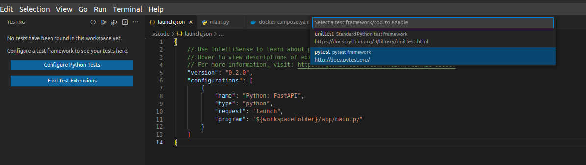
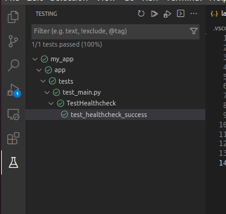

# technical_debt

**YOUR PROJECT INFO GOES HERE**

# Execute this code

## Prerequisites
### 1.- Makefile (Optional)
If you're using a Linux based system you won't have any issues executing a
Makefile, but, if you're using windows, see this link to install make
https://stat545.com/make-windows.html

### 2.- Docker
This project comes with a Dockerfile to ease its execution and avoid possible
incompatibilities between OS, see more at
https://docs.docker.com/engine/install/


### 3.- Compose (docker compose)
In order to docker commands goes transparent for non-docker users we added a
docker-compose file which will automatically bind ports and add volumes you
need.

To install Compose check this link:
https://docs.docker.com/compose/install/

## Run with Makefile (or not)

### Up
Builds the image (if it has not been build) and runs the server locally,
exposing the port **8888**
```
make up
```

If you don't have Make installed, you can run these commands:
```
docker-compose up -d
docker attach technical_debt_app_1
```

You chan check out your server is running visiting this address:

http://localhost:8888/healthcheck

You'll get a response like:

```json
{
"message": "OK!"
}
```

### Test

We're using pytest with flake8 plugin to test our code, you just have to run

```
make test
```

If you don't have Make installed, you can run this command:
```
docker-compose run --rm app sh -c "pytest --flake8"
```

It will execute your unit tests and evaluate your code quality based on pep8
standars using flake8

You can add tests at tests folder using pytest naming rules.

See more at *https://docs.pytest.org/en/latest/explanation/goodpractices.html*

```

app
│   **all other files**
│
└───tests
│   │   __init__.py
│   │   test_main.py
```

### Build
Build your container image using cache.
```
make build
```

If you don't have Make installed, you can run this command:
```
docker-compose build
```

### Rebuild
Rebuild your container image withouth cache.
```
make rebuild
```
If you don't have Make installed, you can run these commands:
```
docker-compose down --remove-orphans
docker-compose build --no-cache
```

## Run with Visual Studio Code
Open your command palette (**Ctrl+Shift+P**) and type **Remote Containers:
Open Folder in Container**



Then, select your project root folder



Make sure you see something like:



Now we'll run our project



Go ahead, you can visit the url at:
```
http://localhost:8888/
```

Want to run some tests? We're prepared. Click on the **Testing icon**


Configure your testing, click on **Configure Python Tests** and then **pytest**



**It's all set!**, you can now run your tests.



## Connection wrapper
Add a connection to the .env file like this:
```
RMS_DRIVER="ODBC Driver 17 for SQL Server"
RMS_SERVER=url.to.the.database.com
RMS_DATABASE=my_database
RMS_UID=user_id
RMS_PWD=super_secret_password
RMS_PORT=1443
```

Now, to connect you only need this code:
```
from db.session import create_db_connection

create_db_connection('rms')
```

## Install docker
 You can follow up this guide to install Docker on windows without Docker Desktop:
 https://dzone.com/articles/wsl2-for-dockerized-net-core-application-subhankar

### Problems with Docker connection through WSL2?
Follow this tutorial to make your docker network standalone:
https://docs.docker.com/network/network-tutorial-standalone/
